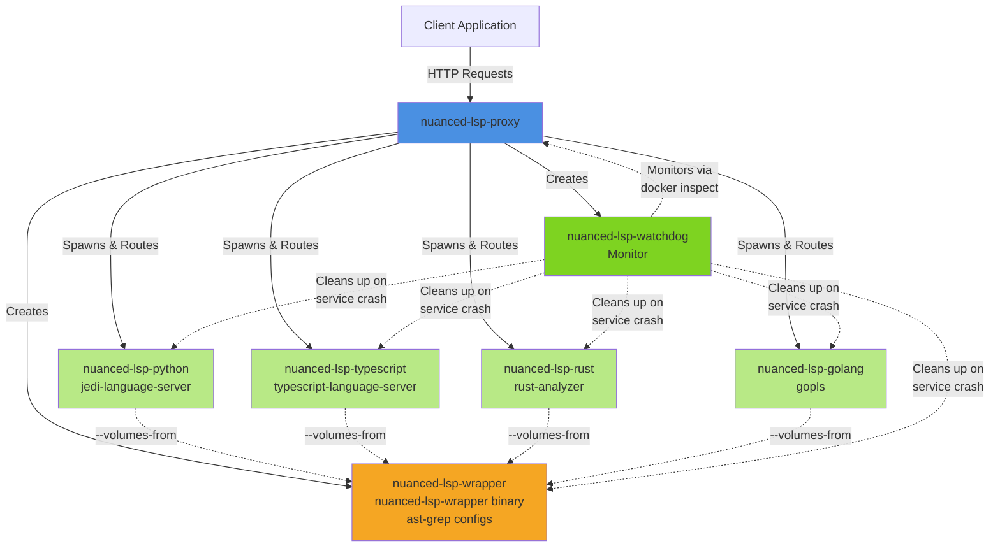
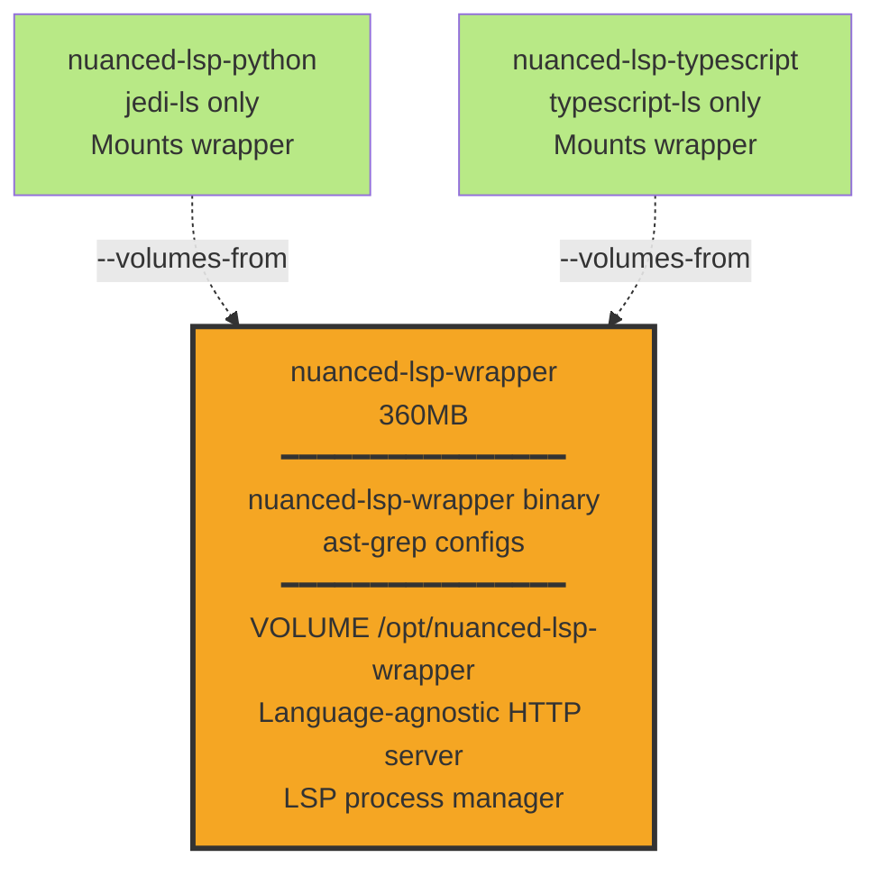
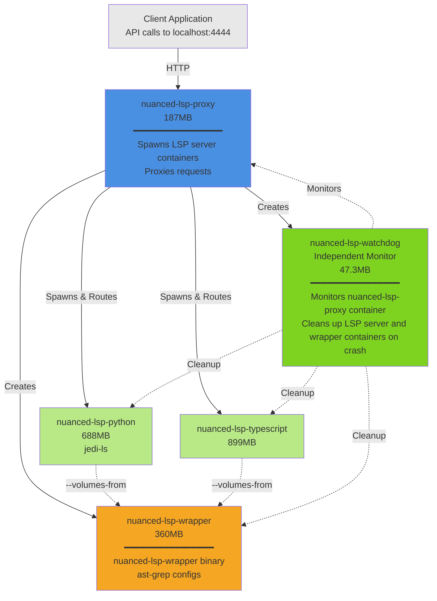

<div align="center">

# Nuanced LSP - Precise code navigation via an API

Originally forked from [agentic-labs/lsproxy](https://github.com/agentic-labs/lsproxy).

[Full API Reference](https://docs.nuanced.dev/lsp/overview)

</div>

## <a name="what-is-lsp">What is Nuanced LSP?</a>

Nuanced LSP is a Dockerized Rust service that proxies LSP requests to LSP server containers, and offers enhanced LSP capabilities by leveraging `ast-grep`.

It supports [multiple languages](#supported-languages) and helps retrieve code context and symbol resolution and symbol relationships for a mounted workspace.

## Key Features

- 🎯 **Precise Cross-File Code Navigation**: Find symbol definitions and references across your entire project.
- 🌐 **Unified API**: Access multiple language servers through a single API.
- 🛠️ **Auto-Configuration**: Automatically detect and configure language servers based on your project files.
- 📊 **Code Diagnostics**: (Coming Soon) Get language-specific lint output from an endpoint.
- 🌳 **Call & Type Hierarchies**: (Coming Soon) Query multi-hop code relationships computed by the language servers.
- 🔄 **Procedural Refactoring**: (Coming Soon) Perform symbol operations like `rename`, `extract`, `auto import` through the API.
- 🧩 **SDK**: A Nuanced LSP TypeScript SDK is available for programmatic access along with a CLI.

## Architecture Overview

The system consists of several containerized components that work together to provide language server functionality:

| Component | Code Reference | Container Name(s) | Purpose | Relationships |
|-----------|---------------|-------------------|---------|---------------|
| **Service** | `crates/proxy` | `nuanced-lsp-proxy` | Main orchestrator that receives HTTP requests from clients, detects file languages, and routes requests to appropriate language containers | Spawns wrapper, language containers, and watchdog; forwards requests between client and language containers |
| **Wrapper** | `crates/wrapper` | `nuanced-lsp-wrapper-<id>` | Shared volume container providing the `lsp-wrapper` binary and ast-grep configs | Mounted by all language containers via `--volumes-from` to share binaries without duplication |
| **Language Containers** | `dockerfiles/*.Dockerfile` | `nuanced-lsp-python-<id>`<br/>`nuanced-lsp-typescript-<id>`<br/>`nuanced-lsp-rust-<id>`<br/>`nuanced-lsp-golang-<id>`<br/>etc. | Run language-specific LSP servers (jedi, typescript-language-server, rust-analyzer, gopls, etc.) and translate HTTP requests to LSP JSON-RPC over stdio | Mount wrapper binary via `--volumes-from`; receive HTTP requests from service; execute LSP operations; labeled with parent service ID |
| **Watchdog** | `crates/watchdog` | `nuanced-lsp-watchdog-<id>` | Independent monitor that polls the service container health and automatically cleans up all language containers if the service crashes or stops | Monitors service via `docker inspect`; uses Docker labels to identify and cleanup language containers belonging to crashed service |

### Key Benefits

- **Process isolation** - Separates proxy service process from LSP server processes, preventing crashes in one language server from affecting others
- **Role-based image organization** - Docker images are cleanly separated into their corresponding roles: service, wrapper, watchdog, and individual language LSP images
- **Lightweight service image** - Service image is relatively small at 187MB, enabling fast deployment and updates
- **Binary injection architecture** - Language LSP server images are independent from the Nuanced LSP Rust code via binary injection, preventing expensive image rebuilds when Rust code changes
- **Dynamic language support** - Language container images are pulled dynamically on-demand based on detected languages in your workspace
- **Automatic cleanup** - Watchdog ensures no orphaned containers remain running if the service crashes or is killed
- **Multi-instance support** - Multiple service instances can run simultaneously, each with isolated language containers identified by unique service IDs
- **Efficient resource sharing** - Wrapper binary and ast-grep configs are shared across all language containers via Docker volumes, avoiding duplication



## <a name="getting-started">Getting Started</a>

### Using the Nuanced LSP SDK

The **Nuanced LSP TypeScript SDK** provides a CLI and a programmatic API.

#### Install the SDK

```bash
npm install -g @nuanced-dev/lsp
```

This installs the `nuanced-lsp` CLI globally.

#### Quick Start with CLI

```bash
# Start the container with your workspace
nuanced-lsp up /path/to/your/workspace

# List all files in the workspace
nuanced-lsp list-files

# Get symbol definitions in a file
nuanced-lsp definitions-in-file src/index.ts

# Find definition at a specific position (line:char, 0-indexed)
nuanced-lsp find-definition src/index.ts --position 10:5

# Find all references to a symbol
nuanced-lsp find-references src/index.ts --position 10:5

# Check service health
nuanced-lsp health

# Check container status
nuanced-lsp status

# Stop the container
nuanced-lsp down
```

#### TypeScript Library Usage

```typescript
import { NuancedLspClient } from '@nuanced-dev/lsp';

const client = new NuancedLspClient();

// Start container with workspace
await client.up({ workspace: '/path/to/workspace' });

// List workspace files
const files = await client.listFiles();
console.log(files);

// Get definitions in a file
const definitions = await client.definitionsInFile({ file: 'src/index.ts' });

// Find definition at position
const definition = await client.findDefinition({
  file: 'src/index.ts',
  position: { line: 10, character: 5 }
});

// Find all references
const references = await client.findReferences({
  file: 'src/index.ts',
  position: { line: 10, character: 5 }
});

// Clean up
await client.down();
```

#### API Commands

**Container Lifecycle:**
- `up` - Start the container with workspace
- `down` - Stop the container
- `status` - Check container status
- `logs` - View container logs
- `pull` - Pull latest Docker image
- `run` - Execute script in container

**Workspace:**
- `list-files` - List all workspace files
- `read-source` - Read file contents (with optional range)

**Symbols:**
- `definitions-in-file` - List all symbol definitions in a file
- `find-definition` - Find definition at position
- `find-identifier` - Find identifiers by name
- `find-referenced-symbols` - Find symbols referenced by a function
- `find-references` - Find all references to a symbol

**System:**
- `health` - Check service and language LSP server health

For full API documentation, see [Nuanced LSP API Reference](https://docs.nuanced.dev/lsp/api-reference).

---

### Local Development

#### Prerequisites
- Docker installed and running
- Git (to clone the repo)

#### Quick Start

```bash
# 1. Build the service container (one-time setup)
#    This builds: orchestrator, lsp-wrapper, and watchdog
./scripts/build-rust-images.sh

# 2. Start the proxy service (language containers are pulled dynamically as needed)
./scripts/start-proxy.sh sample_project/all

# 3. Run tests
./scripts/test.sh
```

**Notes:**
- Language container images are pulled from GitHub Container Registry (ghcr.io) automatically when first needed
- Use `./scripts/stop-proxy.sh` to stop the proxy service
- See [docs/quickstart.md](docs/quickstart.md) for detailed instructions

#### Building Docker images

Nuanced LSP supports multi-architecture Docker images for both `linux/amd64` and `linux/arm64` platforms. This section describes how to build and publish these images.

**Building for Local Development (Single Architecture)**

For local development, you can build images for your native platform:

```bash
# Build Rust containers (wrapper, service, watchdog) without cache
./scripts/build-rust-images.sh

# Build main language containers (8 languages + 7 common Ruby versions)
./scripts/build-language-images.sh

# Build all Ruby versions (110+ versions, takes hours)
./scripts/build-language-images.sh --all-ruby-versions
```

There are many options you can specify with the image build scripts that help with tagging, caching, running builds sequentially vs. parallel, etc. Please view the scripts to see the full options available.

**Building Multi-Architecture Images for Release**

For building images that support both amd64 and arm64:

```bash
# Build multi-arch Rust containers
./scripts/build-rust-images.sh --multiarch

# Build multi-arch language containers (main Ruby versions)
./scripts/build-language-images.sh --multiarch

# Build multi-arch language containers (all Ruby versions)
./scripts/build-language-images.sh --multiarch --all-ruby-versions
```

**Note:** Multi-arch builds use Docker Buildx and may require QEMU for cross-compilation. The build process will be slower than single-architecture builds (2-3x).

**Publishing Images to Registries**

Images can be published to GitHub Container Registry (ghcr.io) and/or Docker Hub for redundancy:

```bash
# Publish to GHCR
./scripts/build-rust-images.sh --multiarch --registry=ghcr --tag X.Y.Z

./scripts/build-language-images.sh --multiarch --registry=ghcr -- tag X.Y.Z
```

**Environment Variables for Publishing:**
- `GITHUB_TOKEN` - Required for publishing to ghcr.io

**Published Image Naming:**
- **GHCR**: `ghcr.io/nuanced-dev/{image-name}:{version}`

Example published images:
```
ghcr.io/nuanced-dev/nuanced-lsp-proxy:0.4.0
ghcr.io/nuanced-dev/nuanced-lsp-wrapper:0.4.0
ghcr.io/nuanced-dev/nuanced-lsp-watchdog:0.4.0
ghcr.io/nuanced-dev/nuanced-lsp-python:0.4.0
ghcr.io/nuanced-dev/nuanced-lsp-ruby-3.4.4:0.4.0
ghcr.io/nuanced-dev/nuanced-lsp-ruby-sorbet-3.4.4:0.4.0
```

### Architecture

The entry point to Nuanced LSP is a **proxy service container**. On initialization, the mounted workspace is scaned, and programming languages are detected based on file path heuristics. The proxy service spawns a **LSP server container** for each supported language detected. After initialization completes, the proxy service proxies HTTP requests from a client to the appropriate LSP server container.

Because LSP servers typically use JSON RPC over stdio, a thin Rust wrapper is injected into each LSP server container on initialization. This wrapper translates HTTP requests received from the proxy service into JSON RPC and forwards to the LSP server. Then the wrapper translates the LSP server's JSON RPC response into a HTTP response for the proxy service.

#### Shared wrapper across all LSP server containers

Nuanced LSP uses **binary injection** to share the `nuanced-lsp-wrapper` binary and `ast-grep` configuration across all LSP server containers. The primary advantage of this technique is language Dockerfiles remain 100% independent from the Nuanced LSP Rust code. This saves on requiring rebuilding the language images every time a Rust code change is made. It also prevents embedding the `nuanced-lsp-wrapper` binary into every language image, saving ~400MB on image size per language image.



#### Container Architecture Example

When you load a workspace with Python and TypeScript files, here's what happens:



**Total image size on disk: 2.2GB** (proxy (187MB) + python (688MB) + typescript (899MB) + wrapper (360MB) + watchdog (47.3MB) = 2.1813MB)

#### Client request example

This sequence diagram shows how a client request is handled:

```mermaid
sequenceDiagram
    participant Client
    participant Proxy as nuanced-lsp-proxy
    participant Wrapper as nuanced-lsp-wrapper
    participant Python LSP as nuanced-lsp-python<br />Jedi language server

    Client->>+Proxy: POST /v2/lsp<br/>lsproxy/symbol/findDefinition<br/>{file: "main.py", position: {line: 10, character: 5}}
    Note over Proxy: Route to Python LSP server container based on file
    Proxy->>+Wrapper: HTTP POST localhost:8080/lsp<br/>lsproxy/symbol/findDefinition<br/>{file: "main.py", position: {line: 10, character: 5}}
    Wrapper->>+Python LSP: LSP Request (JSON-RPC over stdio)<br/>textDocument/definition
    Note over LSP: Jedi analyzes code<br/>finds definition
    Python LSP-->>-Wrapper: LSP Response (JSON-RPC)<br/>{uri, range, ...}
    Note over Wrapper: Translates<br/>LSP response to HTTP
    Wrapper-->>-Proxy: HTTP 200 OK<br/>{definitions: [{path, range, ...}]}
    Proxy-->>-Client: HTTP 200 OK<br/>{definitions: [{path, range, ...}]}
```

#### Container roles

**1. Proxy container (nuanced-lsp-service)** - 187MB
- Built from: `dockerfiles/proxy.Dockerfile` → `crates/proxy`
- Spawns LSP server containers on workspace initialization
- Spawns wrapper and watchdog containers
- Provides HTTP API handlers to proxy client requests to appropriate LSP server container

**2. Wrapper container (nuanced-lsp-wrapper)** - 360MB
- Built from: `dockerfiles/wrapper.Dockerfile` → `crates/wrapper`
- Contains: `nuanced-lsp-wrapper` binary + `ast-grep` configs
- Binary is injected into LSP server containers via Docker volume mounting
- Single container per Nuanced LSP workspace
- Provides HTTP API handlers for Proxy requests
- Translation between proxy HTTP requests and LSP server JSON RPC

**3. Language containers** - Variable sizes (see table below)
- Built from: Language-specific Dockerfiles (pure Debian base)
- Each contains: Language-specific LSP server only (e.g., gopls, rust-analyzer)
- Wrapper binary mounted at runtime via `--volumes-from nuanced-lsp-wrapper`

**4. Watchdog container (nuanced-lsp-watchdog)** - 47.3MB
- Built from: `dockerfiles/watchdog.Dockerfile`
- Monitors proxy container health
- Automatically cleans up wrapper and language containers when proxy container stops

### Development Workflow

```bash
# Run comprehensive tests
./scripts/test.sh

# Start proxy and mount a workspace
./scripts/start-proxy.sh /path/to/your/project --logs

# Optionally restrict the set of enabled languages
ENABLED_LANGUAGES="python,typescript" ./scripts/start-proxy.sh /path/to/your/project

# After proxy and LSP server containers are initialized, you can issue curl requests
curl http://localhost:4444/v2/system/health | jq

# Verify containers
docker ps --filter "name=nuanced-lsp-"

# View logs
docker logs -f nuanced-lsp-proxy

# Stop when done by removing the proxy container
docker rm -f nuanced-lsp-proxy

# Or by shutting down with a script
./scripts/stop-proxy.sh
```

#### Environment Variables

**`ENABLED_LANGUAGES`** (optional)
- Comma-separated list of languages to enable
- For each detected language in a workspace, Nuanced LSP spawns the associated LSP server as an isolated container
- Use this to restrict which language containers are spawned
- Language names are case-insensitive and support aliases:
  - `python`
  - `typescript`, `javascript`
  - `rust`
  - `go`
  - `java`
  - `php`
  - `ruby`, `ruby-sorbet`, `sorbet`
  - `cpp`, `c++`, `c`
  - `csharp`, `c#`

**`NUANCED_LSP_MAX_MEMORY`** (optional)
- Maximum memory limit per language container in megabytes (MB)
- Default: `20480` (20GB)
- Large codebases (e.g., Kubernetes) may require higher memory limits for operations like find-references
- Set lower for resource-constrained environments

**`RUST_IMAGE_VERSION`** (optional)
- Docker image tag for Rust containers (proxy, wrapper, watchdog)
- Default: `0.5.0`
- Use `latest` for development or specify a version for production
- Primarily used by test scripts and CI/CD pipelines

**`LANGUAGE_IMAGE_VERSION`** (optional)
- Docker image tag for language server containers (Python, TypeScript, etc.)
- Default: `1.0.0`
- Use `latest` for development or specify a version for production
- Primarily used by test scripts and CI/CD pipelines

**Examples:**
```bash
# Only spawn Python and TypeScript containers
ENABLED_LANGUAGES="python,typescript" ./scripts/start-proxy.sh

# Using language aliases
ENABLED_LANGUAGES="go,cpp" ./scripts/start-proxy.sh

# Case-insensitive with spaces
ENABLED_LANGUAGES="Python, TypeScript, Rust" ./scripts/start-proxy.sh

# Set memory limit to 8GB per container
NUANCED_LSP_MAX_MEMORY=8192 ./scripts/start-proxy.sh

# Combine environment variables
ENABLED_LANGUAGES="go" NUANCED_LSP_MAX_MEMORY=16384 ./scripts/start-proxy.sh

# Without ENABLED_LANGUAGES, all detected languages spawn (default)
./scripts/start-proxy.sh

# Use specific Docker image versions (for testing or CI/CD)
RUST_IMAGE_VERSION=latest LANGUAGE_IMAGE_VERSION=1.0.0 ./scripts/test.sh

# Test with production versions
RUST_IMAGE_VERSION=0.5.0 LANGUAGE_IMAGE_VERSION=1.0.0 ./scripts/test.sh
```

### Supported languages and LSP image sizes

Each supported language and its LSP server image is built from pure Debian base and contains only the language-specific LSP server and associated system dependencies:

| Language | Container | Dockerfile | Image Size | Language Server |
|----------|-----------|------------|------------|----------------|
| Python | `nuanced-lsp-python` | `dockerfiles/python.Dockerfile` | 688MB | jedi-language-server |
| TypeScript/JavaScript | `nuanced-lsp-typescript` | `dockerfiles/typescript.Dockerfile` | 899MB | typescript-language-server |
| Golang | `nuanced-lsp-golang` | `dockerfiles/golang.Dockerfile` | 702MB | gopls |
| Rust | `nuanced-lsp-rust` | `dockerfiles/rust.Dockerfile` | 1.06GB | rust-analyzer |
| C/C++ | `nuanced-lsp-clangd` | `dockerfiles/clangd.Dockerfile` | 953MB | clangd |
| PHP | `nuanced-lsp-php` | `dockerfiles/php.Dockerfile` | 790MB | phpactor |
| Java | `nuanced-lsp-java` | `dockerfiles/java.Dockerfile` | 1.16GB | eclipse-jdtls |
| C# | `nuanced-lsp-csharp` | `dockerfiles/csharp.Dockerfile` | 2.2GB | omnisharp |
| Ruby | `nuanced-lsp-ruby-3.4.4` | `dockerfiles/ruby-3.4.4.Dockerfile` | 985MB | ruby-lsp |
| Ruby (Sorbet) | `nuanced-lsp-ruby-sorbet-3.4.4` | `dockerfiles/ruby-sorbet-3.4.4.Dockerfile` | 1.02MB | sorbet |

**Wrapper Container**: `nuanced-lsp-wrapper` (360MB) - Contains the `nuanced-lsp-wrapper` binary and `ast-grep` configs, shared via `--volumes-from` across all language containers

### Acknowledgements

Nuanced LSP started as a fork of `agentic-labs/lsproxy`. We celebrate and call out the capabilities and contribution from Agentic Labs, and thank them for graciously providing `lsproxy` as an open-source project. We applaud the originality and creativity of using `ast-grep` in combination with LSP capabilities like `find-definition` and `find-references` within a single binary that makes it easy to "proxy" to LSP servers. The Agentic Labs vision of `lsproxy` is still a shining example of what building code intelligence tooling for AI workflows can be, and we are grateful for the opportunity to build on `lsproxy`.

### Where Nuanced LSP improves over agentic-labs/lsproxy

There are some areas in which we found `lsproxy` could be improved to support more flexible operation (i.e. local or cloud), make it easier to tune system resources, make it easier to maintain the project and its associated Dockerfiles, and provide a more efficient runtime.

The following is a summary of the base `lsproxy` implementation and where Nuanced LSP improves on that base.

**Base implementation [agentic-labs/lsproxy](https://github.com/agentic-labs/lsproxy) uses a single process / image model:**
- Single image containing all LSP servers, languages, and system dependencies results in 13.5GB image.
- Distribution requires rebuilding the 13.5GB image.
- Slow image build time for multiple architectures.
- LSP servers and their dependencies are comingled in the same image as the Rust service code. Change one or the other can lead to expensive rebuilds.
- Clients only using one or two LSP servers must still download the full image containing unused LSP servers and dependencies.

**Nuanced LSP and dynamic container orchestration**:
- **Clients only download what they need:** core required images are the proxy (187MB), watchdog (47.7MB), and wrapper (360MB) images, in addition to LSP server images based on workspace composiiton
- **Flexible runtime:** LSP server containers now run as isolated containers, and can run locally or on remote hosts with higher system resource allocation
- **Isolated code changes:** The proxy, watchdog, and wrapper crates are independent from each other, and can be built in parallel. No cascading builds when the Rust code changes.
- **Faster dev loop:** Build only the image needed based on local changes.
- **Docker development loop:** Running Nuanced LSP locally for development is the same runtime and configuration Nuanced LSP uses in production or on end-user hosts. Docker daemon makes it easy to track individual LSP server system resource metrics and indexing latency.
- **LSP server debug loop:** LSP server images are built in isolation, making it easy to test and experiment with LSP servers without cascading image builds.
- **Language version control:** Very detailed language-version support is now possible and included for Ruby / Sorbet. LSP server containers can now be versioned by language versions. This is especially helpful for languages like Ruby.

### Documentation

See the `docs/` for more detailed documentation.
