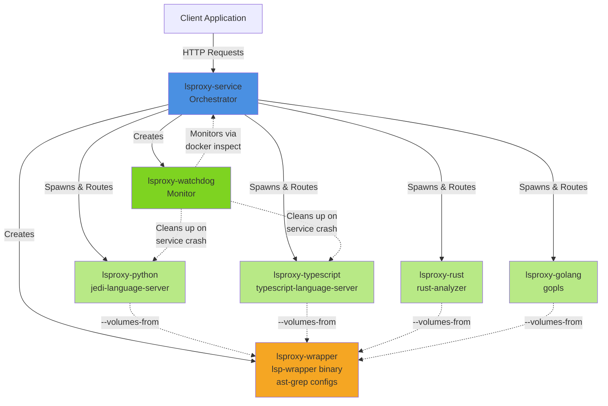
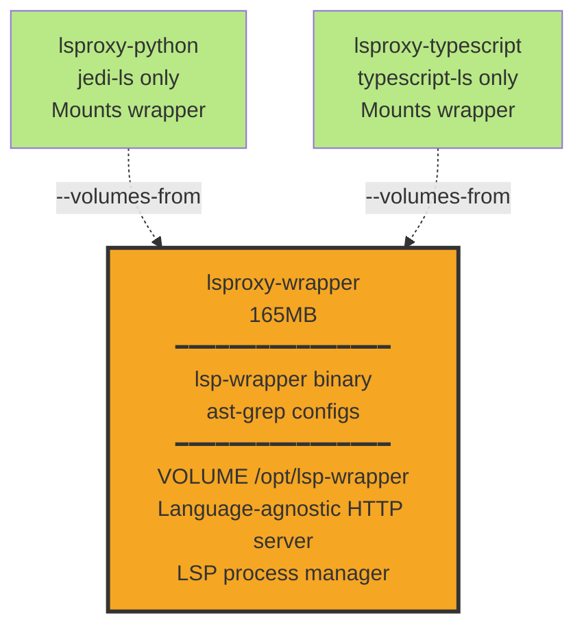
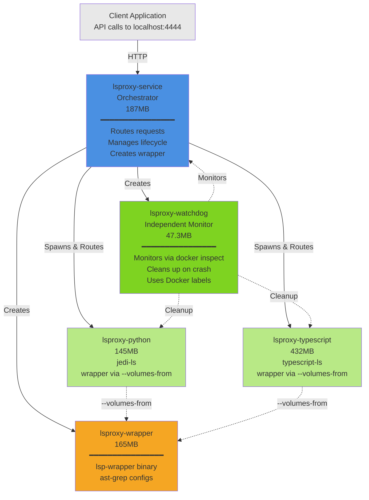
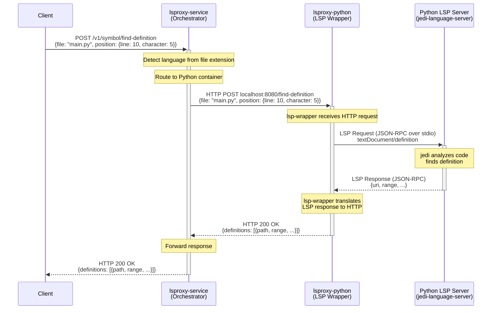

<div align="center">

# Nuanced LSProxy - Precise code navigation via an API

Originally forked from [agentic-labs/lsproxy](https://github.com/agentic-labs/lsproxy).

[Full API Reference](https://docs.nuanced.dev/lsp/overview)

</div>

## <a name="what-is-lsproxy">What is lsproxy?</a>

Nuanced LSProxy is a Dockerized Rust service that proxies LSP requests to LSP server containers, and offers enhanced LSP capabilities by leveraging `ast-grep`.

It supports [multiple languages](#supported-languages) and helps retrieve code context and symbol resolution and symbol relationships for a mounted workspace.

## Key Features

- 🎯 **Precise Cross-File Code Navigation**: Find symbol definitions and references across your entire project.
- 🌐 **Unified API**: Access multiple language servers through a single API.
- 🛠️ **Auto-Configuration**: Automatically detect and configure language servers based on your project files.
- 📊 **Code Diagnostics**: (Coming Soon) Get language-specific lint output from an endpoint.
- 🌳 **Call & Type Hierarchies**: (Coming Soon) Query multi-hop code relationships computed by the language servers.
- 🔄 **Procedural Refactoring**: (Coming Soon) Perform symbol operations like `rename`, `extract`, `auto import` through the API.
- 🧩 **SDK**: A Nuanced LSP TypeScript SDK is available for programmatic access along with a CLI.

## Architecture Overview

The system consists of several containerized components that work together to provide language server functionality:

| Component | Code Reference | Container Name(s) | Purpose | Relationships |
|-----------|---------------|-------------------|---------|---------------|
| **Service** | `crates/orchestrator` | `lsproxy-service` | Main orchestrator that receives HTTP requests from clients, detects file languages, and routes requests to appropriate language containers | Spawns wrapper, language containers, and watchdog; forwards requests between client and language containers |
| **Wrapper** | `crates/lsp-wrapper` | `lsproxy-wrapper-<service-id>` | Shared volume container providing the `lsp-wrapper` binary and ast-grep configs | Mounted by all language containers via `--volumes-from` to share binaries without duplication |
| **Language Containers** | `dockerfiles/*.Dockerfile` | `lsproxy-python-<service-id>`<br/>`lsproxy-typescript-<service-id>`<br/>`lsproxy-rust-<service-id>`<br/>`lsproxy-golang-<service-id>`<br/>etc. | Run language-specific LSP servers (jedi, typescript-language-server, rust-analyzer, gopls, etc.) and translate HTTP requests to LSP JSON-RPC over stdio | Mount wrapper binary via `--volumes-from`; receive HTTP requests from service; execute LSP operations; labeled with parent service ID |
| **Watchdog** | `crates/watchdog` | `lsproxy-watchdog-<service-id>` | Independent monitor that polls the service container health and automatically cleans up all language containers if the service crashes or stops | Monitors service via `docker inspect`; uses Docker labels to identify and cleanup language containers belonging to crashed service |

### Key Benefits

- **Process isolation** - Separates proxy service process from LSP server processes, preventing crashes in one language server from affecting others
- **Role-based image organization** - Docker images are cleanly separated into their corresponding roles: service, wrapper, watchdog, and individual language LSP images
- **Lightweight service image** - Service image is relatively small at 187MB, enabling fast deployment and updates
- **Binary injection architecture** - Language LSP server images are completely independent from lsproxy Rust code via binary injection, preventing expensive image rebuilds when Rust code changes
- **Dynamic language support** - Language container images are pulled dynamically on-demand based on detected languages in your workspace
- **Automatic cleanup** - Watchdog ensures no orphaned containers remain running if the service crashes or is killed
- **Multi-instance support** - Multiple service instances can run simultaneously, each with isolated language containers identified by unique service IDs
- **Efficient resource sharing** - Wrapper binary and ast-grep configs are shared across all language containers via Docker volumes, avoiding duplication



## <a name="getting-started">Getting Started</a>

### Using the Nuanced LSP SDK (Recommended)

The easiest way to use this fork is through the **Nuanced LSP TypeScript SDK**, which provides both a CLI and a programmatic API.

#### Install the SDK

```bash
npm install -g @nuanced-dev/lsp
```

This installs the `nuanced-lsp` CLI globally.

#### Quick Start with CLI

```bash
# Start the container with your workspace
nuanced-lsp up /path/to/your/workspace

# List all files in the workspace
nuanced-lsp list-files

# Get symbol definitions in a file
nuanced-lsp definitions-in-file src/index.ts

# Find definition at a specific position (line:char, 0-indexed)
nuanced-lsp find-definition src/index.ts --position 10:5

# Find all references to a symbol
nuanced-lsp find-references src/index.ts --position 10:5

# Check container status
nuanced-lsp status

# Stop the container
nuanced-lsp down
```

#### TypeScript Library Usage

```typescript
import { NuancedLspClient } from '@nuanced-dev/lsp';

const client = new NuancedLspClient();

// Start container with workspace
await client.up({ workspace: '/path/to/workspace' });

// List workspace files
const files = await client.listFiles();
console.log(files);

// Get definitions in a file
const definitions = await client.definitionsInFile({ file: 'src/index.ts' });

// Find definition at position
const definition = await client.findDefinition({
  file: 'src/index.ts',
  position: { line: 10, character: 5 }
});

// Find all references
const references = await client.findReferences({
  file: 'src/index.ts',
  position: { line: 10, character: 5 }
});

// Clean up
await client.down();
```

#### API Commands

**Container Lifecycle:**
- `up` - Start the container with workspace
- `down` - Stop the container
- `status` - Check container status
- `logs` - View container logs
- `pull` - Pull latest Docker image
- `run` - Execute script in container

**Workspace:**
- `list-files` - List all workspace files
- `read-source` - Read file contents (with optional range)

**Symbols:**
- `definitions-in-file` - List all symbol definitions in a file
- `find-definition` - Find definition at position
- `find-identifier` - Find identifiers by name
- `find-referenced-symbols` - Find symbols referenced by a function
- `find-references` - Find all references to a symbol

**System:**
- `health` - Check server health and language readiness

For full API documentation, see [Nuanced LSP API Reference](https://docs.nuanced.dev/lsp/api-reference/container-lifecycle).

---

### Local Development (Contributors)

If you're contributing to lsproxy itself:

```bash
# 1. Build all containers (one-time setup)
./scripts/build-all-containers.sh

# 2. Start the service
./scripts/start-service.sh

# 3. Run tests
cargo test --workspace           # Unit tests
./scripts/test-all-endpoints.sh  # Integration tests
```

See [docs/quickstart.md](docs/quickstart.md) for detailed development instructions.

### Architecture

LSProxy uses a **service container** that dynamically spawns **language-specific containers**. This provides massive space savings compared to the original monolithic implementation.

#### Binary Injection Architecture

LSProxy uses a **binary injection** architecture to share the `lsp-wrapper` binary and `ast-grep` configs across all language containers without duplication:



This approach eliminates the need for a base image and prevents cascading rebuilds when wrapper code changes.

#### Container Architecture Example

When you load a workspace with Python and TypeScript files, here's what happens:



**Total image size on disk: 976MB** (service + python + typescript + wrapper + watchdog)

#### Request Flow

This sequence diagram shows how a client request flows through the system:



**Key Points:**
- **Two-tier architecture**: Client communicates with service (HTTP), service communicates with language containers (HTTP)
- **Language detection**: Service determines which container to route to based on file extension
- **LSP translation**: Language containers translate HTTP requests to LSP JSON-RPC over stdio
- **Container isolation**: Each language server runs in its own isolated container

#### Container Components

**1. Service Container (lsproxy-service)** - 187MB
- Built from: `dockerfiles/service.Dockerfile` → `crates/orchestrator`
- Thin HTTP handlers that proxy requests to language containers
- Detects languages in workspace and spawns only needed containers
- Manages container lifecycle and routing
- Creates and maintains the shared wrapper container

**2. Wrapper Container (lsproxy-wrapper)** - 165MB
- Built from: `dockerfiles/wrapper.Dockerfile` → `crates/wrapper`
- Contains: `lsp-wrapper` binary + `ast-grep` configs
- Shared across all language containers via `--volumes-from`
- Single instance, no duplication
- Language-agnostic: Generic HTTP server + LSP process manager
- Configuration passed via environment variables and CMD args from language containers

**3. Language Containers** - Variable sizes (see table below)
- Built from: Language-specific Dockerfiles (pure Debian base)
- Each contains: Language-specific LSP server only (e.g., gopls, rust-analyzer)
- Wrapper binary mounted at runtime via `--volumes-from lsproxy-wrapper`
- Full LSP communication handlers with stdio→HTTP translation
- Only spawned when language files are detected in workspace

**4. Watchdog Container (lsproxy-watchdog)** - 47.3MB
- Built from: `dockerfiles/watchdog.Dockerfile`
- Monitors service container health
- Automatically cleans up language containers on service crash
- Minimal footprint for reliability

**5. Common Library (lsproxy-common)**
- Not a container - compiled into orchestrator and wrapper
- Shared types, utilities, AST-grep integration
- Zero runtime overhead, zero duplication

### Development Workflow

```bash
# Start service with your workspace
./scripts/start-service.sh /path/to/your/project --logs

# Restrict which language containers are spawned (optional)
ENABLED_LANGUAGES="python,typescript" ./scripts/start-service.sh /path/to/your/project

# In another terminal, make changes and test
curl http://localhost:4444/v1/system/health | jq

# Run comprehensive tests
./scripts/test-all-endpoints.sh

# Check what's running
docker ps --filter "name=lsproxy-"

# View logs
docker logs -f lsproxy-service

# Stop when done
docker rm -f lsproxy-service
```

#### Environment Variables

**`ENABLED_LANGUAGES`** (optional)
- Comma-separated list of languages to enable
- By default, LSProxy spawns containers for all detected languages in the workspace
- Use this to restrict which language containers are spawned
- Language names are case-insensitive and support aliases:
  - `python`
  - `typescript`, `javascript`
  - `rust`
  - `golang`, `go`
  - `java`
  - `php`
  - `ruby`, `ruby-sorbet`, `sorbet`
  - `cpp`, `c++`, `c`
  - `csharp`, `c#`

**Examples:**
```bash
# Only spawn Python and TypeScript containers
ENABLED_LANGUAGES="python,typescript" ./scripts/start-service.sh

# Using language aliases
ENABLED_LANGUAGES="go,cpp" ./scripts/start-service.sh

# Case-insensitive with spaces
ENABLED_LANGUAGES="Python, TypeScript, Rust" ./scripts/start-service.sh

# Without ENABLED_LANGUAGES, all detected languages spawn (default)
./scripts/start-service.sh
```

### Available Scripts

| Script | Purpose |
|--------|---------|
| `scripts/start-service.sh` | Start LSProxy service with workspace |
| `scripts/build-all-containers.sh` | Build all language containers |
| `scripts/test-all-endpoints.sh` | Test all endpoints for all languages |
| `scripts/test-container-lifecycle.sh` | Test container orchestration |

### Language Container Sizes

Each language container is built from pure Debian base and contains only the language-specific LSP server. The `lsp-wrapper` binary and `ast-grep` configs are shared at runtime via the wrapper container:

| Language | Container | Dockerfile | Image Size | Language Server |
|----------|-----------|------------|------------|----------------|
| Python | `lsproxy-python` | `dockerfiles/python.Dockerfile` | 145MB | jedi-language-server |
| TypeScript/JavaScript | `lsproxy-typescript` | `dockerfiles/typescript.Dockerfile` | 432MB | typescript-language-server |
| Golang | `lsproxy-golang` | `dockerfiles/golang.Dockerfile` | 610MB | gopls |
| Rust | `lsproxy-rust` | `dockerfiles/rust.Dockerfile` | 1.02GB | rust-analyzer |
| C/C++ | `lsproxy-clangd` | `dockerfiles/clangd.Dockerfile` | 566MB | clangd |
| PHP | `lsproxy-php` | `dockerfiles/php.Dockerfile` | 398MB | phpactor |
| Java | `lsproxy-java` | `dockerfiles/java.Dockerfile` | 1.03GB | eclipse-jdtls |
| C# | `lsproxy-csharp` | `dockerfiles/csharp.Dockerfile` | 2.12GB | omnisharp |
| Ruby | `lsproxy-ruby-3.4.4` | `dockerfiles/ruby-3.4.4.Dockerfile` | 598MB | solargraph |
| Ruby (Sorbet) | `lsproxy-ruby-sorbet-3.4.4` | `dockerfiles/ruby-sorbet-3.4.4.Dockerfile` | 631MB | sorbet |

**Wrapper Container**: `lsproxy-wrapper` (165MB) - Contains lsp-wrapper binary and ast-grep configs, shared via `--volumes-from` across all language containers

### Why This Architecture Saves Space

**Monolithic Approach (Original)**: 13.3GB single image
- Contains ALL language servers and dependencies
- Must download and store 13.3GB even for a single-language project
- Updates require rebuilding entire 13.3GB image

**Container Orchestration with Binary Injection**: ~500MB-1.5GB typical usage
- Service container (187MB) + wrapper container (165MB) + only needed language containers
- **Example 1**: Python-only project = 187MB + 165MB + 145MB + 47MB = **544MB** (96% savings)
- **Example 2**: Python + TypeScript project = 187MB + 165MB + 145MB + 432MB + 47MB = **976MB** (93% savings)
- **Example 3**: All 10 languages = 187MB + 165MB + 7.1GB + 47MB = **7.5GB** (44% savings)
- Wrapper changes: Rebuild 1 wrapper image (165MB), no language container rebuilds
- Language changes: Rebuild only affected language container(s)

**Binary Injection Benefits**:
- **No cascading rebuilds**: Wrapper code changes don't trigger language container rebuilds
- **Smaller language containers**: No duplicated wrapper binary (saves ~165MB per container)
- **Single source of truth**: One wrapper container shared across all language containers
- **Faster iteration**: Edit wrapper code → rebuild 165MB image → restart service (no language rebuilds)

**Additional Benefits**:
- Parallel container builds (faster CI/CD)
- Language containers can be cached independently
- Easier to add new language support without affecting others
- Better resource isolation and crash recovery via watchdog
- Docker volume sharing enables efficient binary distribution

### Documentation

- [docs/architecture.md](docs/architecture.md) - Complete system architecture and request flow diagrams
- [docs/quickstart.md](docs/quickstart.md) - Get running in 3 minutes
- [docs/testing.md](docs/testing.md) - Comprehensive testing guide

## <a name="supported-languages">Supported languages</a>

We're looking to add new language support or better language servers so let us know what you need!
|Language|Server|URL|
|:-|:-|:-|
|C/C++|`clangd`|https://clangd.llvm.org/|
|C#|`omnisharp`|https://github.com/OmniSharp/csharp-language-server-protocol|
|Golang|`gopls`|https://github.com/golang/tools/tree/master/gopls|
|Java|`jdtls`|https://github.com/eclipse-jdtls/eclipse.jdt.ls|
|Javascript|`typescript-language-server`|https://github.com/typescript-language-server/typescript-language-server|
|PHP|`phpactor`|https://github.com/phpactor/phpactor|
|Python|`jedi-language-server`|https://github.com/pappasam/jedi-language-server|
|Ruby|`sorbet`|https://sorbet.org/docs/lsp|
|Rust|`rust-analyzer`|https://github.com/rust-lang/rust-analyzer|
|Typescript|`typescript-language-server`|https://github.com/typescript-language-server/typescript-language-server|
|Your Favorite Language | Awesome Language Server | https://github.com/nuanced-dev/lsproxy/issues/new |
