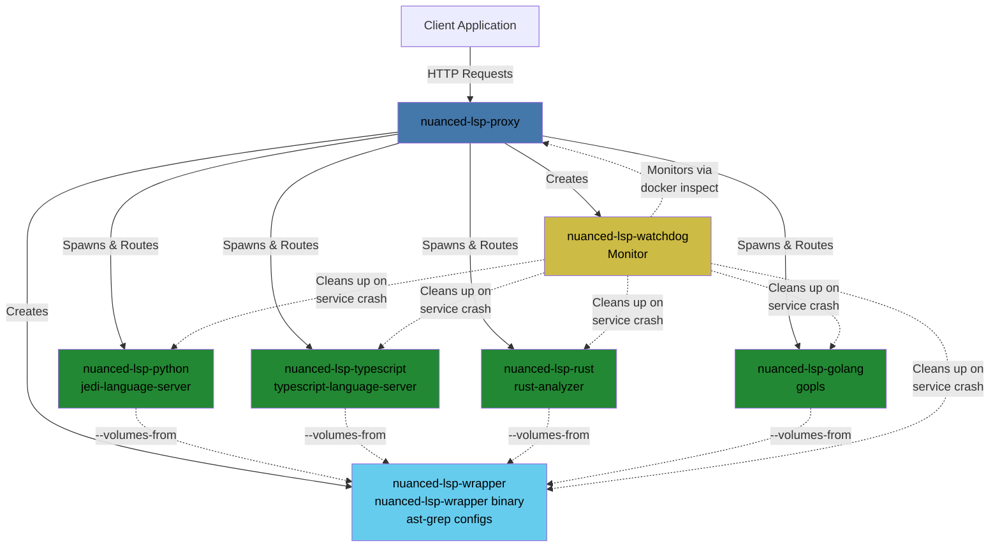
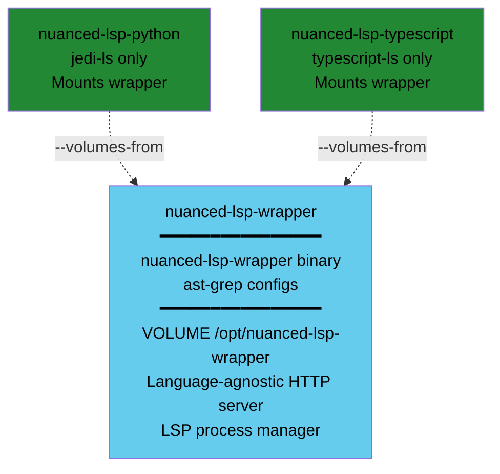
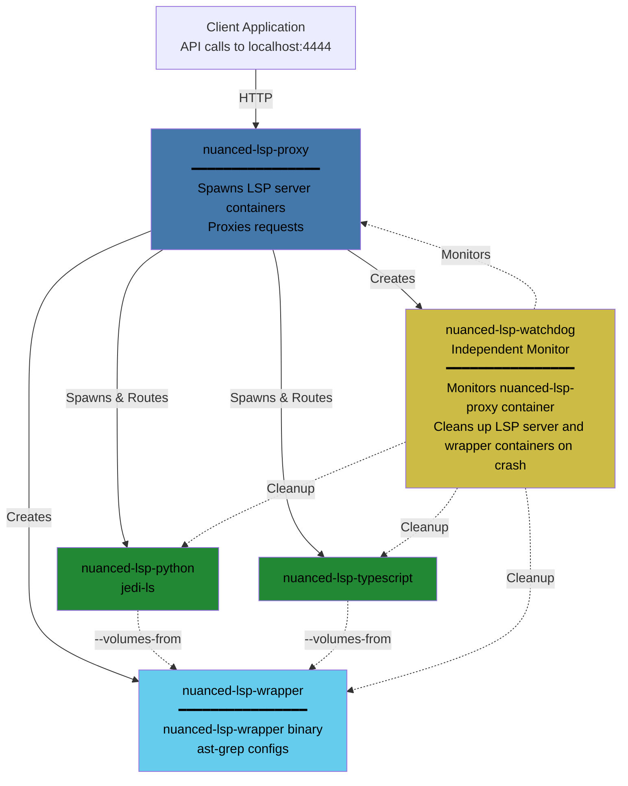

# Archtecture

## Overview

Nuanced LSP consists of the following service and language components.

- **Proxy:** Manages the other service containers and the language containers, serves the API, and forwards API requests to the right language containers.

- **Watchdog:** Cleans up other containers if the proxy unexpectedly fails.

- **Wrapper:** Contains the binary that manages LSP server processes and serves the internal API that is called by the proxy. The wrapper container does not run LSP servers directly. Instead the binary is injected into the language containers, which run it. This allows for updating the wrapper logic without having to rebuild every language image.

- **Languages:** Contains the LSP server for a specific language. It does not contain the wrapper binary it runs to serve the internal API, but relies on the wrapper being injected at run time.

## System components

The system consists of several containerized components that work together to provide language server functionality:

| Component | Code Reference | Container Name(s) | Purpose | Relationships |
|-----------|---------------|-------------------|---------|---------------|
| **Proxy** | `crates/proxy` and `dockerfiles/proxy.Dockerfile` | `nuanced-lsp-proxy` | Main orchestrator that receives HTTP requests from clients, detects file languages, and routes requests to appropriate language containers | Spawns wrapper, language containers, and watchdog; forwards requests between client and language containers |
| **Wrapper** | `crates/wrapper` and `dockerfiles/wrapper.Dockerfile` | `nuanced-lsp-wrapper-<id>` | Shared volume container providing the `lsp-wrapper` binary and ast-grep configs | Mounted by all language containers via `--volumes-from` to share binaries without duplication |
| **Language Containers** | `dockerfiles/<language>.Dockerfile` | `nuanced-lsp-<language>-<id>` | Run language-specific LSP servers (jedi, typescript-language-server, rust-analyzer, gopls, etc.) and translate HTTP requests to LSP JSON-RPC over stdio | Mount wrapper binary via `--volumes-from`; receive HTTP requests from service; execute LSP operations; labeled with parent service ID |
| **Watchdog** | `crates/watchdog` and `dockerfiles/watchdog.Dockerfile` | `nuanced-lsp-watchdog-<id>` | Independent monitor that polls the service container health and automatically cleans up all language containers if the service crashes or stops | Monitors service via `docker inspect`; uses Docker labels to identify and cleanup language containers belonging to crashed service |

### Key Benefits

- **Process isolation** - Separates proxy service process from LSP server processes, preventing crashes in one language server from affecting others
- **Role-based image organization** - Docker images are cleanly separated into their corresponding roles: service, wrapper, watchdog, and individual language LSP images
- **Lightweight service image** - Service image is relatively small, enabling fast deployment and updates
- **Binary injection architecture** - Language LSP server images are independent from the Nuanced LSP Rust code via binary injection, preventing expensive image rebuilds when Rust code changes
- **Dynamic language support** - Language container images are pulled dynamically on-demand based on detected languages in your workspace
- **Automatic cleanup** - Watchdog ensures no orphaned containers remain running if the service crashes or is killed
- **Multi-instance support** - Multiple service instances can run simultaneously, each with isolated language containers identified by unique service IDs
- **Efficient resource sharing** - Wrapper binary and ast-grep configs are shared across all language containers via Docker volumes, avoiding duplication



### In-depth description

The entry point to Nuanced LSP is a **proxy service container**. On initialization, the mounted workspace is scaned, and programming languages are detected based on file path heuristics. The proxy service spawns a **LSP server container** for each supported language detected. After initialization completes, the proxy service proxies HTTP requests from a client to the appropriate LSP server container.

Because LSP servers typically use JSON RPC over stdio, a thin Rust wrapper is injected into each LSP server container on initialization. This wrapper translates HTTP requests received from the proxy service into JSON RPC and forwards to the LSP server. Then the wrapper translates the LSP server's JSON RPC response into a HTTP response for the proxy service.

#### Shared wrapper across all LSP server containers

Nuanced LSP uses **binary injection** to share the `nuanced-lsp-wrapper` binary and `ast-grep` configuration across all LSP server containers. The primary advantage of this technique is language Dockerfiles remain 100% independent from the Nuanced LSP Rust code. This saves on requiring rebuilding the language images every time a Rust code change is made. It also prevents embedding the `nuanced-lsp-wrapper` binary into every language image, saving image size per language image.



#### Container Architecture Example

When you load a workspace with Python and TypeScript files, here's what happens:



#### Client request example

This sequence diagram shows how a client request is handled:

```mermaid
sequenceDiagram
    participant Client
    participant Proxy as nuanced-lsp-proxy
    participant Wrapper as nuanced-lsp-wrapper
    participant Python as nuanced-lsp-python<br />Jedi language server

    Client->>+Proxy: POST /v1/symbol/find-definition<br/>{file: "main.py", position: {line: 10, character: 5}}
    Note over Proxy: Route to Python LSP server container based on file
    Proxy->>+Wrapper: HTTP POST localhost:8080/find-definition<br/>{file: "main.py", position: {line: 10, character: 5}}
    Wrapper->>+Python: LSP Request (JSON-RPC over stdio)<br/>textDocument/definition
    Note over Python: Jedi analyzes code<br/>finds definition
    Python-->>-Wrapper: LSP Response (JSON-RPC)<br/>{uri, range, ...}
    Note over Wrapper: Translates<br/>LSP response to HTTP
    Wrapper-->>-Proxy: HTTP 200 OK<br/>{definitions: [{path, range, ...}]}
    Proxy-->>-Client: HTTP 200 OK<br/>{definitions: [{path, range, ...}]}

    style Proxy fill:#47A,color:#000
    style Wrapper fill:#6CE,color:#000
    style Python fill:#283,color:#000
```
