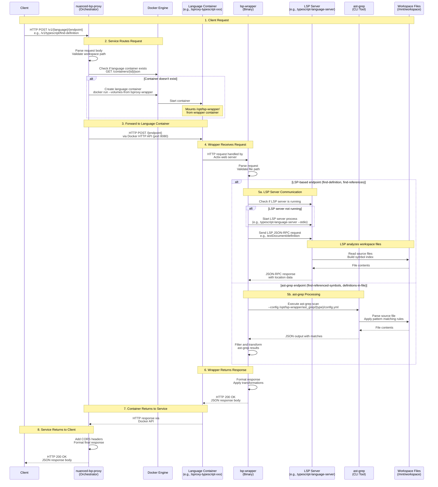

# LSProxy Architecture

## System Overview

LSProxy is a containerized Language Server Protocol (LSP) proxy service that provides unified access to multiple language servers through a single HTTP API. The system uses a binary injection architecture to minimize image rebuild cascades and optimize resource usage.

## Request Flow Sequence Diagram



## Component Details

### 1. nuanced-lsp-proxy (Orchestrator)
- **Technology**: Rust (Actix-web framework)
- **Location**: `crates/proxy/`
- **Container**: `nuanced-lsp-proxy`
- **Port**: 4444 (exposed to host)
- **Responsibilities**:
  - HTTP API gateway (exposes `/v1/{language}/{endpoint}`)
  - Container lifecycle management (create, monitor, remove)
  - Request routing to appropriate language containers
  - Workspace management and validation
  - JWT authentication (optional)
  - CORS handling
  - Swagger UI documentation

### 2. lsproxy-wrapper (Binary)
- **Technology**: Rust (Actix-web framework)
- **Location**: `crates/wrapper/`
- **Container**: `lsproxy-wrapper` (volume provider only)
- **Binary Path**: `/opt/lsp-wrapper/bin/lsp-wrapper`
- **Port**: 8080 (internal within language containers)
- **Responsibilities**:
  - HTTP server running inside each language container
  - LSP server process management (spawn, monitor, restart)
  - LSP JSON-RPC communication (stdin/stdout)
  - ast-grep integration for pattern-based queries
  - Request validation and error handling
  - Response formatting and transformation

### 3. Language Containers
- **Examples**: `lsproxy-typescript-xxx`, `lsproxy-python-xxx`, `lsproxy-ruby-xxx`
- **Dockerfiles**: `dockerfiles/{language}.Dockerfile`
- **Base Images**: Debian Bookworm Slim
- **Key Features**:
  - Language runtime and dependencies (e.g., Node.js, Python, Ruby)
  - LSP server installation (e.g., typescript-language-server, pyright)
  - Volume mounts:
    - `--volumes-from lsproxy-wrapper` (shares `/opt/lsp-wrapper/`)
    - Workspace mount at `/mnt/workspace`
  - Entrypoint: `/opt/lsp-wrapper/bin/lsp-wrapper` (shared binary)
  - Isolated execution environment per workspace

### 4. LSP Servers
- **Examples**:
  - TypeScript: `typescript-language-server --stdio`
  - Python: `pyright-langserver --stdio`
  - Rust: `rust-analyzer`
  - Go: `gopls`
  - Ruby: `ruby-lsp`
- **Communication**: JSON-RPC over stdin/stdout
- **Operations**:
  - `textDocument/definition` - Find symbol definitions
  - `textDocument/references` - Find all references to symbol
  - `textDocument/hover` - Get hover information
  - `textDocument/completion` - Code completion

### 5. ast-grep
- **Technology**: Pattern-based code search tool
- **Installation**: Python package (`ast-grep-cli`)
- **Binary Path**: `/opt/lsp-wrapper/bin/ast-grep` (shared via volume)
- **Config Path**: `/opt/lsp-wrapper/ast_grep/{type}/config.yml`
- **Config Types**:
  - `symbol/` - Function/class definitions
  - `identifier/` - Variable/function names
  - `reference/` - Symbol usage patterns
- **Usage**: Fast pattern matching for structural queries

### 6. Watchdog (Container Cleanup)
- **Technology**: Rust async task (part of orchestrator)
- **Location**: `crates/proxy/src/container/mod.rs`
- **Responsibilities**:
  - Ensures all containers are cleaned up when service stops
  - Handles both graceful shutdown and crash scenarios
  - Manages cleanup of language containers and wrapper container
- **Cleanup Process**:
  1. **Normal Shutdown**: When service stops gracefully (via signal or API), `cleanup_all()` is called from `main.rs`
  2. **Crash Recovery**: If service crashes/exits unexpectedly, Docker's restart policy or external orchestration handles cleanup
  3. **Cleanup Order**:
     - Stop all language containers first (iterates through active containers)
     - Stop wrapper container last (via `stop_wrapper_container()`)
     - Wrapper must be stopped last since language containers depend on its volumes
- **Signal File**: Writes `/tmp/cleanup_complete` on successful cleanup
- **Code Location**: `crates/proxy/src/container/mod.rs:336-350` (`cleanup_all()`)

**Why Watchdog Matters:**
- Prevents orphaned containers consuming resources
- Ensures wrapper container (required for `--volumes-from`) is properly cleaned up
- Maintains clean state between service restarts
- Language containers cannot function without wrapper container running

## Binary Injection Architecture

The system uses **binary injection** via Docker volumes to share the wrapper binary and ast-grep across all language containers:

```
┌────────────────────────────────────┐
│ lsproxy-wrapper                    │
│ (Volume Container)                 │
│                                    │
│ /opt/lsp-wrapper/                  │
│  ├── bin/                          │
│  │   ├── lsp-wrapper (Rust binary) │
│  │   └── ast-grep   (Python CLI)   │
│  └── ast_grep/                     │
│      ├── symbol/                   │
│      ├── identifier/               │
│      └── reference/                │
└────────────────────────────────────┘
         │
         │ --volumes-from
         ├──────────────────┐
         ├──────────────────┼──────────────────┐
         │                  │                  │
         ▼                  ▼                  ▼
┌─────────────────┐ ┌─────────────────┐ ┌─────────────────┐
│ lsproxy-        │ │ lsproxy-        │ │ lsproxy-        │
│ typescript-xxx  │ │ python-xxx      │ │ rust-xxx        │
│                 │ │                 │ │                 │
│ Language: TS    │ │ Language: Python│ │ Language: Rust  │
│ LSP: ts-ls      │ │ LSP: pyright    │ │ LSP: rust-analyzer
│                 │ │                 │ │                 │
│ Mounts:         │ │ Mounts:         │ │ Mounts:         │
│ /opt/lsp-wrapper│ │ /opt/lsp-wrapper│ │ /opt/lsp-wrapper│
│ /mnt/workspace  │ │ /mnt/workspace  │ │ /mnt/workspace  │
└─────────────────┘ └─────────────────┘ └─────────────────┘
```

### Benefits
1. **No Rebuild Cascade**: Changing wrapper code only requires rebuilding one container
2. **Consistent Binaries**: All containers use identical wrapper and ast-grep versions
3. **Smaller Images**: Language containers don't embed wrapper binary (~50MB saved per image)
4. **Faster Updates**: Deploy wrapper changes without rebuilding 227 language images

## Network Architecture

```
┌────────────────────────────────────────────────────────┐
│ Host Machine                                           │
│                                                        │
│  ┌──────────────────────────────────────────────────┐  │
│  │ nuanced-lsp-proxy                                  │  │
│  │ Port: 4444 (exposed)                             │  │
│  │ Network: bridge                                  │  │
│  └──────────────┬───────────────────────────────────┘  │
│                 │ Docker API                           │
│                 │ (Unix socket)                        │
│                 ▼                                      │
│  ┌──────────────────────────────────────────────────┐  │
│  │ Docker Engine                                    │  │
│  └──────────────┬───────────────────────────────────┘  │
│                 │                                      │
│                 │ Container Communication              │
│                 │ (Docker bridge network)              │
│                 │                                      │
│     ┌───────────┼───────────┬────────────┐             │
│     │           │           │            │             │
│     ▼           ▼           ▼            ▼             │
│  ┌─────────┐ ┌─────────┐ ┌─────────┐ ┌─────────┐       │
│  │ wrapper │ │ ts-xxx  │ │ py-xxx  │ │ rust-xxx│       │
│  │ (vol)   │ │ :8080   │ │ :8080   │ │ :8080   │       │
│  └─────────┘ └─────────┘ └─────────┘ └─────────┘       │
│                                                        │
└────────────────────────────────────────────────────────┘
```

## Request Lifecycle

### Example: Find Definition Request

1. **Client Request**:
   ```bash
   curl -X POST http://localhost:4444/v1/typescript/find-definition \
     -H "Content-Type: application/json" \
     -d '{
       "path": "src/index.ts",
       "position": {"line": 10, "character": 5}
     }'
   ```

2. **Service Processing**:
   - Validates workspace path exists
   - Checks if `lsproxy-typescript-{workspace-id}` container exists
   - Creates container if needed with `--volumes-from lsproxy-wrapper`
   - Forwards request via Docker API to container port 8080

3. **Wrapper Processing**:
   - Receives HTTP request at `/find-definition`
   - Checks if `typescript-language-server` is running
   - Starts LSP if needed: `typescript-language-server --stdio`
   - Sends JSON-RPC request:
     ```json
     {
       "jsonrpc": "2.0",
       "id": 1,
       "method": "textDocument/definition",
       "params": {
         "textDocument": {"uri": "file:///mnt/workspace/src/index.ts"},
         "position": {"line": 10, "character": 5}
       }
     }
     ```

4. **LSP Server Processing**:
   - Parses TypeScript files in workspace
   - Builds symbol table and cross-references
   - Resolves definition location

5. **Response Chain**:
   - LSP → Wrapper: JSON-RPC response with location
   - Wrapper → Service: HTTP 200 with transformed JSON
   - Service → Client: HTTP 200 with final JSON response

## Container Lifecycle

### Startup Sequence
1. User starts service: `./scripts/start-proxy.sh`
2. Orchestrator container starts: `nuanced-lsp-proxy`
3. Wrapper volume container starts: `lsproxy-wrapper` (provides volumes)
4. Language containers created on-demand when first request arrives

### Shutdown Sequence
1. User stops service: `./scripts/stop-proxy.sh`
2. All language containers removed
3. Wrapper container removed
4. Orchestrator container removed

### Container Naming
- Service: `nuanced-lsp-proxy`
- Wrapper: `lsproxy-wrapper`
- Languages: `lsproxy-{language}-{workspace-id}`
  - Example: `lsproxy-typescript-a1b2c3d4-e5f6-7890-abcd-ef1234567890`

## Configuration

### Environment Variables
- `WORKSPACE_PATH`: Path to workspace directory (required)
- `PORT`: Service port (default: 4444)
- `REQUIRE_AUTH`: Enable JWT authentication (default: false)
- `ENABLED_LANGUAGES`: Comma-separated list of languages to enable
  - Example: `ENABLED_LANGUAGES=typescript,python,rust`
  - If not set, all languages are enabled

### Volume Mounts
- **Wrapper volume**: `/opt/lsp-wrapper/` shared to all language containers
- **Workspace**: User's project directory mounted at `/mnt/workspace`
- **Docker socket**: `/var/run/docker.sock` for container management

## Supported Languages

| Language   | LSP Server              | Container Prefix       |
|------------|-------------------------|------------------------|
| TypeScript | typescript-language-server | lsproxy-typescript- |
| JavaScript | typescript-language-server | lsproxy-javascript- |
| Python     | pyright-langserver     | lsproxy-python-     |
| Rust       | rust-analyzer          | lsproxy-rust-       |
| Go         | gopls                  | lsproxy-golang-     |
| Java       | jdtls                  | lsproxy-java-       |
| C/C++      | clangd                 | lsproxy-clangd-     |
| C#         | OmniSharp             | lsproxy-csharp-     |
| PHP        | intelephense          | lsproxy-php-        |
| Ruby       | ruby-lsp              | lsproxy-ruby-       |
| Ruby (Sorbet) | sorbet             | lsproxy-ruby-sorbet-|

## API Endpoints

### System Endpoints
- `GET /v1/system/health` - Health check
- `GET /swagger-ui/` - Swagger documentation

### Workspace Endpoints
- `POST /v1/workspace/list-files` - List all files in workspace

### Language-Specific Endpoints
All endpoints accept POST requests with JSON body.

Pattern: `/v1/{language}/{endpoint}`

**LSP-based endpoints**:
- `/v1/{language}/find-definition` - Find symbol definition
- `/v1/{language}/find-references` - Find all references
- `/v1/{language}/read-source` - Read file contents with optional range

**ast-grep endpoints**:
- `/v1/{language}/definitions-in-file` - Get all definitions in file
- `/v1/{language}/find-identifier` - Find identifier by name
- `/v1/{language}/find-referenced-symbols` - Find symbols referenced in function body

## Testing

Run comprehensive endpoint tests:
```bash
./scripts/test-all-endpoints.sh
```

Current test coverage: **93/94 tests passing (98.9%)**

## Future Architecture Simplification

The current binary injection architecture using `--volumes-from` and the wrapper container could be further simplified in a future refactor by eliminating the wrapper container entirely and using Docker stdin/stdout mounting for direct LSP server communication.

### Current Architecture Limitations

The current system requires:
- A dedicated wrapper container (`lsproxy-wrapper`) running continuously to provide volume access
- Binary injection via `--volumes-from` to share the `lsp-wrapper` binary and `ast-grep` configs
- Three-tier architecture: orchestrator → wrapper → LSP servers
- Complex volume mount dependencies

### Proposed Simplified Architecture

**Core Idea**: The orchestrator container directly manages LSP server processes running in language-specific containers using Docker's stdin/stdout mounting capabilities.

**How It Would Work**:

1. **Eliminate the wrapper container**:
   - No need for `lsproxy-wrapper` volume container
   - No `--volumes-from` volume mounting
   - Remove binary injection complexity

2. **Direct LSP communication**:
   - Orchestrator spawns language containers with LSP servers
   - Use `docker run` with stdin/stdout mounting: `docker run -i --mount type=bind,src=/workspace,dst=/mnt/workspace lsproxy-python python -m pyright --stdio`
   - Orchestrator communicates directly with LSP via container stdin/stdout
   - Send JSON-RPC requests over stdin, receive responses from stdout

3. **Simplified container structure**:
   ```
   nuanced-lsp-proxy (orchestrator)
       ├─ docker run -i lsproxy-python (LSP server process)
       ├─ docker run -i lsproxy-typescript (LSP server process)
       ├─ docker run -i lsproxy-rust (LSP server process)
       └─ ... (other language containers)
   ```

4. **Implementation approach**:
   - Language containers only need LSP server and runtime (no wrapper binary)
   - Orchestrator maintains persistent stdin/stdout pipes to each LSP container
   - JSON-RPC communication flows: Client → Orchestrator → LSP (stdin) → LSP (stdout) → Orchestrator → Client
   - Container lifecycle: spawn on first request, keep alive for session, cleanup on shutdown

### Benefits

- **Simpler architecture**: Only two tiers (orchestrator → LSP) instead of three
- **Fewer containers**: Eliminate wrapper container entirely
- **No volume mount complexity**: Direct stdin/stdout communication
- **Reduced dependencies**: No need for `--volumes-from` or volume sharing
- **Easier debugging**: Direct pipe communication is more straightforward
- **Smaller images**: Language containers don't need wrapper binary or ast-grep

### Trade-offs

- **LSP lifecycle management**: Orchestrator must handle stdin/stdout pipe management for each LSP process
- **Error handling**: Need robust handling for broken pipes, container crashes
- **ast-grep operations**: Would need alternative approach (could run ast-grep directly in orchestrator or as separate service)
- **State persistence**: LSP server state tied to container lifecycle (similar to current architecture)

### Migration Path

This simplification could be implemented incrementally:

1. **Phase 1**: Proof of concept with single language (e.g., Python)
   - Implement direct stdin/stdout mounting for one LSP server
   - Verify JSON-RPC communication works correctly
   - Test performance and reliability

2. **Phase 2**: Extend to all languages
   - Migrate remaining LSP servers to direct communication
   - Handle language-specific LSP initialization differences
   - Update container images to remove wrapper dependencies

3. **Phase 3**: Remove wrapper container
   - Eliminate `lsproxy-wrapper` build and deployment
   - Remove `--volumes-from` logic from orchestrator
   - Clean up binary injection code

4. **Phase 4**: Handle ast-grep alternative
   - Move ast-grep to orchestrator container, or
   - Implement ast-grep as separate microservice, or
   - Use LSP-native alternatives where possible

### Open Questions

- How to handle ast-grep operations without shared binary?
- Performance impact of stdin/stdout vs current HTTP communication?
- Container lifecycle: persistent vs ephemeral LSP processes?
- Compatibility with all LSP servers via stdin/stdout?

This future architecture would significantly reduce system complexity while maintaining all current functionality. The trade-off is shifting some complexity from volume mounting to stdin/stdout pipe management, which is arguably more standard and easier to reason about.
